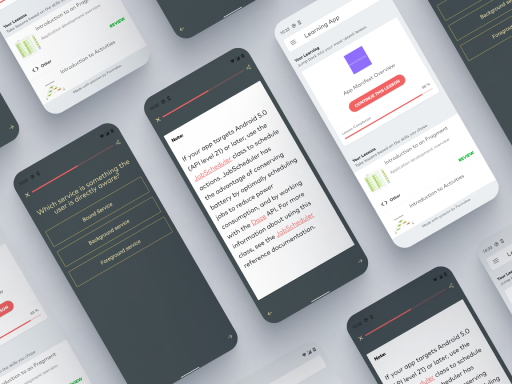

# Learn Android Application
This is an open source project to display how you can use [Formaloo](https://en.formaloo.com/) [api](https://en.formaloo.com/developers/) in your project.

## Installation
Clone this repository and import into **Android Studio**

git clone https://github.com/formaloo/formaloo-android-learn-android-development.git

## The App
The sample app contains a list of Android lessons.
[The APK is available now in the Google Play Store](https://play.google.com/store/apps/details?id=co.idearun.learnandroid).



To create your own forms you need an Formaloo account, [you can signup now](https://accounts.formaloo.net/profiles/signup/?) :)
After login to your account go to [dashboard](https://dash.formaloo.net/u/) and create your desire forms.

## The Code 
Each lesson is a form and form fields create the lesson content. To create a form and fields programmatically you need API_KEY and API_SECRET:
1.Go to your [CDP Dashboard](https://cdp.formaloo.net/) and create a Connection to get your API_KEY and API_SECRET.
2.Use your keys to connect to the api. API Key must be included in all requests to the api. Also you need to authorize your app using one of Authorization Code or Client Credentials flow.

After you are done with your forms you need a tag to assign to each form. Using the tag we can fetch forms list. To fetch form yo do not need above keys. 
You can find the detail of used endpoints at this project below: 

<details>
<summary>Create Form</summary>
<br>
Create Form
<br><br>

```java
OkHttpClient client = new OkHttpClient().newBuilder()
    .build();
MediaType mediaType = MediaType.parse("application/json");
RequestBody body = RequestBody.create(mediaType, "{
"form_fields": [
    "field_cua2HD7TRT"
],
"theme_config": {
    "background_type": "full_page",
    "background_shadow": "rgba(0,0,0,0,0)",
    "widget_settings": {
    "position": "right",
    "type": "side-widget",
    "once_per_user": false
}
},
"logo": "",
"form_type": "simple",
"form_redirects_after_submit": "www.google.com",
"submit_email_notif": false,
"send_user_confirm": false,
"send_emails_to": "farokh.shahabi@gmail.com",
"button_text": "ارسال",
"show_title": true,
"shuffle_fields": false,
"active": true,
"submit_end_time": null,
"submit_start_time": null,
"max_submit_count": 20,
"success_message": "<p>This message is shown after filling your form.</p>",
"time_limit": "10:00",
"background_color": "{\"r\":67,\"g\":78,\"b\":82,\"a\":1}",
"border_color": "{\"r\":176,\"g\":161,\"b\":96,\"a\":0.63}",
"submit_text_color": "{\"r\":255,\"g\":255,\"b\":255,\"a\":1}",
"button_color": "{\"r\":210,\"g\":175,\"b\":64,\"a\":1}",
"text_color": "{\"r\":250,\"g\":234,\"b\":173,\"a\":1}",
"field_color": "{\"r\":67,\"g\":78,\"b\":82,\"a\":1}",
"description": "You can use a wysiwyg text.",
"category": "",
"address": "vxag2",
"title": "Learning Form"
}");
Request request = new Request.Builder()
.url("{{formz_server}}/v3/forms/")
.method("POST", body)
.addHeader("x-api-key", "{{formz-x-api-key}}")
.addHeader("Authorization", "JWT {{authorization_token}}")
.addHeader("Content-Type", "application/json")
.build();
Response response = client.newCall(request).execute();
```

</details>


<details>
<summary>Create Field</summary>
<br>
Create Field
<br><br>

```java
/**Create Field*/

OkHttpClient client = new OkHttpClient().newBuilder()
.build();
MediaType mediaType = MediaType.parse("application/json");
RequestBody body = RequestBody.create(mediaType, "{
"description": "",
"required": false,
"sub_type": "section",
"title": "New section Field",
"type": "meta"
}");
Request request = new Request.Builder()
.url("{{formz_server}}/v2/fields/field/")
.method("POST", body)
.addHeader("x-api-key", "{{formz-x-api-key}}")
.addHeader("Authorization", "JWT {{authorization_token}}")
.addHeader("Content-Type", "application/json")
.build();
Response response = client.newCall(request).execute();
```

</details>


<details>
<summary>Submit form</summary>
<br>
Submit form
<br><br>

```java
OkHttpClient client = new OkHttpClient().newBuilder()
  .build();
MediaType mediaType = MediaType.parse("application/json");
RequestBody body = RequestBody.create(mediaType, "{
    "field_JgKgX2vVPh": "Elon Musk",
    "field_5W20yy3DaK": "elun@gmail.com",
    "field_nAJ37M4evJ": "0986532",
    "field_1NmHHfA8Di": "Change your mind change your life :/",
    "field_FUJbCETEnF": "Nothing else matter.",
    "field_rclec28puk": 10,
    "field_rDwobYWOM9": "https://www.google.com",
    "field_7oMYWqr9ln": "2021-06-19",
    "field_jYWIVBb9gS": 10,
    "field_vMuD60oWKq": "yes",
    "field_i7OXMLqRh0": "choice_SlLBeJ7uI5",
    "field_JSy1XvUJfQ": [
        "choice_44sguJcv3p",
        "choice_Aanyeg6Zsj"
    ],
    "field_GFUOFRUTeg": "choice_hqcOEipwGU"
}");
Request request = new Request.Builder()
  .url("{{formz_server}}/v2/forms/form/cv7kTWdv/submit/")
  .method("POST", body)
  .addHeader("x-api-key", "{{formz-x-api-key}}")
  .addHeader("Authorization", "JWT {{authorization_token}}")
  .addHeader("Content-Type", "application/json")
  .build();
Response response = client.newCall(request).execute();
```

</details>


<details>
<summary>Create Tag</summary>
<br>
Create Tag
<br><br>

```java
OkHttpClient client = new OkHttpClient().newBuilder()
  .build();
MediaType mediaType = MediaType.parse("application/json");
RequestBody body = RequestBody.create(mediaType, "{
		"title": "Blue Tag",
		"color": "#0000AA",
		"address": "blue-tag"
		}");
Request request = new Request.Builder()
  .url("{{formz_server}}/v3/form-tags/")
  .method("POST", body)
  .addHeader("x-api-key", "{{formz-x-api-key}}")
  .addHeader("Authorization", "JWT {{authorization_token}}")
  .addHeader("Content-Type", "application/json")
  .build();
Response response = client.newCall(request).execute();
```

</details>


<details>
<summary>Assign a tag to a form</summary>
<br>
Assign a tag to a form
<br><br>

```java
OkHttpClient client = new OkHttpClient().newBuilder()
  .build();
MediaType mediaType = MediaType.parse("application/json");
RequestBody body = RequestBody.create(mediaType, "{
		"tags":["tpOuD6hR"]
		}");
Request request = new Request.Builder()
  .url("{{formz_server}}/v2/forms/form/{form_slug}/")
  .method("PATCH", body)
  .addHeader("x-api-key", "{{formz-x-api-key}}")
  .addHeader("Authorization", "JWT {{authorization_token}}")
  .addHeader("Content-Type", "application/json")
  .build();
Response response = client.newCall(request).execute();
```

</details>


<details>
<summary>Retrieve form list by tag address</summary>
<br>
Retrieve form list by tag address
<br><br>

```java
OkHttpClient client = new OkHttpClient().newBuilder()
  .build();
Request request = new Request.Builder()
  .url("{{formz_server}}/v3/form-displays/tag/{tag_address}/")
  .method("GET", null)
  .addHeader("x-api-key", "{{formz-x-api-key}}")
  .addHeader("Authorization", "JWT {{authorization_token}}")
  .addHeader("Content-Type", "application/json")
  .build();
Response response = client.newCall(request).execute();
```

</details>


<details>
<summary>Retrieve form detail by form address</summary>
<br>
Retrieve form list by form address
<br><br>

```java
OkHttpClient client = new OkHttpClient().newBuilder()
  .build();
Request request = new Request.Builder()
  .url("{{formz_server}}/v3/form-displays/address/{form_address}/")
  .method("GET", null)
  .addHeader("x-api-key", "{{formz-x-api-key}}")
  .addHeader("Authorization", "JWT {{authorization_token}}")
  .addHeader("Content-Type", "application/json")
  .build();
Response response = client.newCall(request).execute();
```

</details>

You can also find the full documentation on the [developers page](https://en.formaloo.com/developers/)


